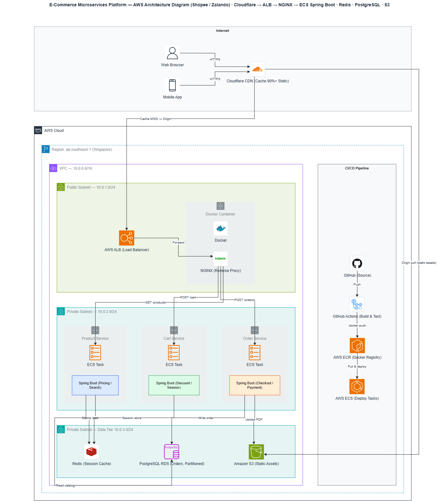

# Shopeee E-Commerce Platform

Shopeee là một full-stack e-commerce project được xây dựng để thực hành
microservices architecture với Spring Boot, React, PostgreSQL và Docker. Phiên
bản hiện tại là MVP, tập trung vào product catalog, shopping cart, payment và
order tracking.

## Tính năng

- Danh sách, tìm kiếm, chi tiết sản phẩm và lọc theo danh mục
- Sản phẩm nổi bật và chương trình Flash Sale
- Giỏ hàng theo session: thêm, xóa, tăng và giảm số lượng
- Checkout với kiểm tra tồn kho và tính phí vận chuyển
- Thanh toán COD và mô phỏng chuyển hướng VNPay/MoMo
- Tra cứu đơn hàng bằng số điện thoại
- Hủy đơn hàng khi đơn chưa bắt đầu giao
- Dữ liệu mẫu cho sản phẩm, danh mục và đơn hàng
- REST API và tài liệu Swagger UI
- Docker Compose cho PostgreSQL, backend và frontend

## Công nghệ sử dụng

| Tầng | Công nghệ |
| --- | --- |
| Backend | Java 17, Spring Boot 3.3, Spring Web, Spring Data JPA, Lombok |
| Database | PostgreSQL 16 |
| Frontend | React 19, TypeScript, Vite |
| Triển khai local | Docker, Docker Compose, Nginx |
| Kiến trúc cloud | AWS VPC, ALB, ECS, ECR, RDS, ElastiCache/Redis, S3 |

## Kiến trúc AWS

Sơ đồ kiến trúc AWS được trình bày trực tiếp bên dưới để có thể xem ngay trên
GitHub:



Kiến trúc thể hiện luồng từ người dùng qua Cloudflare CDN, AWS ALB và NGINX
đến các ECS task Spring Boot; tầng dữ liệu sử dụng Redis, PostgreSQL RDS và
Amazon S3. Pipeline CI/CD đi từ GitHub Actions đến AWS ECR và AWS ECS.

Các phiên bản của sơ đồ:

- [Xem ảnh SVG độ phân giải cao](docs/architecture/aws-ecommerce-platform.svg)
- [Mở sơ đồ AWS trên diagrams.net](docs/architecture/ecommerce-platform.drawio)
- [Tài liệu thư mục kiến trúc](docs/architecture/README.md)

File `.drawio` là bản chi tiết dùng để xem và chỉnh sửa các subnet, luồng mạng
và thành phần triển khai.

## Chạy dự án

### Backend và database bằng Docker

Tạo file `.env` từ file mẫu:

```bash
copy .env.example .env
```

Sau đó khởi động toàn bộ hệ thống:

```bash
docker compose up --build
```

Các địa chỉ truy cập:

- Frontend: <http://localhost:30092>
- Backend API: <http://localhost:8080>
- Swagger UI: <http://localhost:8080/swagger-ui.html>

### Chạy backend không dùng Docker

Khởi động PostgreSQL ở port `5432`, cấu hình biến môi trường trong file `.env`,
sau đó chạy:

```bash
./mvnw spring-boot:run
```

Trên Windows:

```powershell
.\mvnw.cmd spring-boot:run
```

### Chạy frontend ở chế độ phát triển

```bash
cd frontend
npm install
npm run dev
```

Frontend mặc định gọi API tại `http://localhost:8080/api`.

## Cấu trúc dự án

```text
src/main/java/com/shopeee/
├── cart/          # API, model, repository và service của giỏ hàng
├── config/        # CORS, OpenAPI và dữ liệu mẫu
├── exception/     # Business exception và xử lý lỗi tập trung
├── order/         # Checkout, thanh toán và theo dõi đơn hàng
└── product/       # Sản phẩm và danh mục

frontend/src/
├── api/           # Client gọi backend API
├── components/    # Các thành phần giao diện dùng chung
├── contexts/      # State của giỏ hàng và thông báo
└── pages/         # Các trang của storefront
```

## Kiểm tra

```bash
cd frontend
npm run build
npm run lint
```

Backend test cần PostgreSQL đang chạy với các biến môi trường đã cấu hình.

## Trạng thái dự án

Đây là MVP phục vụ mục đích học tập. Cổng thanh toán hiện đang được mô phỏng;
authentication, admin dashboard và việc tách các bounded context thành các
service deploy độc lập là những hướng phát triển tiếp theo.
